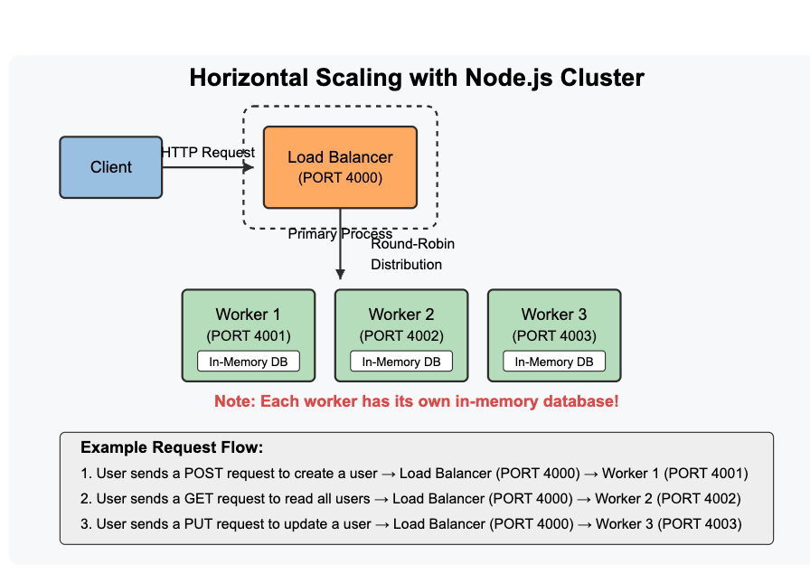

# CRUD API with In-Memory Database

A simple implementation of a CRUD API using an in-memory database with TypeScript and Node.js.

## Features

- RESTful CRUD operations for user management
- Horizontal scaling with Node.js Cluster API
- Multiple load balancing algorithms (Round-Robin, IP Hash, Least Connections)

## Requirements

- Node.js (version 22.14.0 or higher)

## API Endpoints

- `GET /api/users` - Get all users
- `GET /api/users/{userId}` - Get a user by ID
- `POST /api/users` - Create a new user
- `PUT /api/users/{userId}` - Update a user
- `DELETE /api/users/{userId}` - Delete a user

## User Object

```typescript
interface User {
  id: string;          // UUID generated on server
  username: string;    // Required
  age: number;         // Required
  hobbies: string[];   // Required (can be empty array)
}
```

## Installation and Testing

1. Clone the repository
   ```
   git clone <repository-url>
   cd crud-api
   ```

2. Install dependencies
   ```
   npm install
   ```
3. Environment variables steup (!IMPORTANT) ‼️
   - Rename the .env.sample to .env and add your expected port and load balancing algorithm (default is round-robin)

## Available Scripts

- `npm start:dev` or `npm start`  - Start the server in development mode
- `npm run start:multi` - Start with horizontal scaling (cluster mode)
- `npm run test` - Test nornmal
- `npm run test:coverage` - Test with coverage
- `npm run start:prod` - Run the production mode

## Special Note for Runs the Production Mode
If you facing any error  like up and running the production mode, Please follow the steps below,
- `npm run clean`
- `npm run build`
- `npm run start:prod`

## Development

The project uses TypeScript and follows a modular architecture:

- `src/index.ts` - Application entry point
- `src/models/` - Data models and validation
- `src/controllers/` - Request handlers
- `src/server/` - Server infrastructure

## Horizontal Scaling

The application supports horizontal scaling using Node.js Cluster API:

```
npm run start:multi
```

This starts multiple worker processes (one per CPU core minus 1) with a load balancer that distributes requests using the selected algorithm (configured in `.env`).



Available load balancing algorithms:
- `round-robin` - Distributes requests sequentially across workers
- `ip-hash` - Routes requests from the same IP to the same worker (best for session consistency)
- `least-connections` - Routes to the worker with the fewest active connections

## Basic Scope Testing

- **+10** The repository with the application contains a `README.md` file containing detailed instructions for installing, running and using the application ✅
- **+10** **GET** `api/users` implemented properly ✅
- **+10** **GET** `api/users/{userId}` implemented properly ✅
- **+10** **POST** `api/users` implemented properly ✅
- **+10** **PUT** `api/users/{userId}` implemented properly ✅
- **+10** **DELETE** `api/users/{userId}` implemented properly
- **+6** Users are stored in the form described in the technical requirements ✅
- **+6** Value of `port` on which application is running is stored in `.env` file ✅

## Advanced Scope
- **+30** Task implemented on Typescript  ✅
- **+10** Processing of requests to non-existing endpoints implemented properly ✅
- **+10** Errors on the server side that occur during the processing of a request should be handled and processed properly ✅
- **+10** Development mode: `npm` script `start:dev` implemented properly ✅
- **+10** Production mode: `npm` script `start:prod` implemented properly ✅

## Hacker Scope
- **+30** There are tests for API (not less than **3** scenarios) ✅


- **+50** There is horizontal scaling for application with a **load balancer** ✅

Since my local machine having 10 cores, 9 parallism workers initiated


